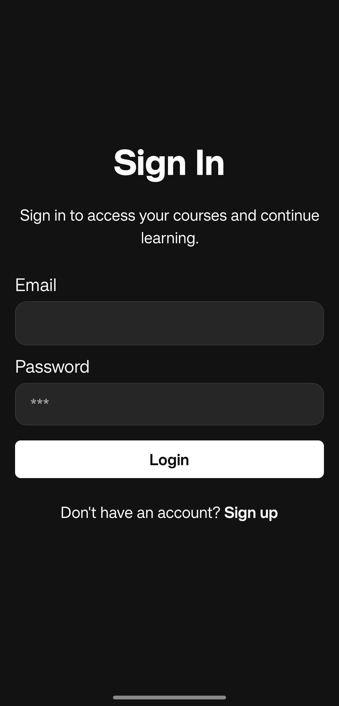
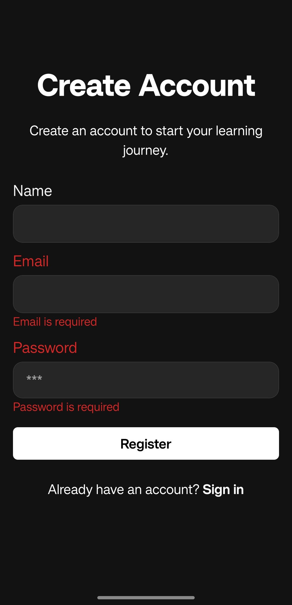
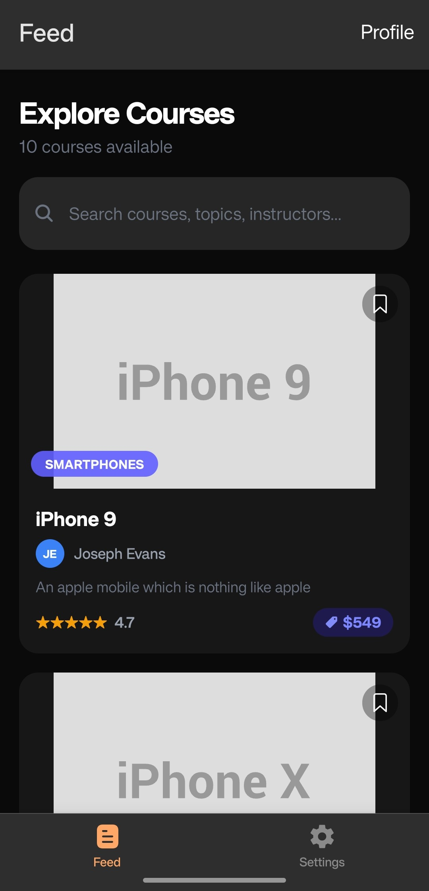
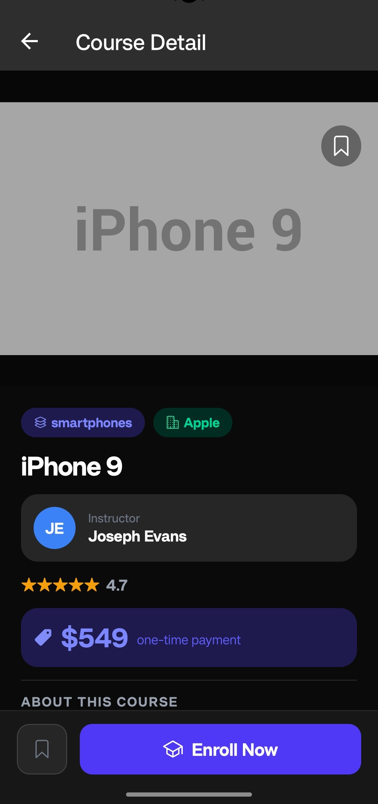
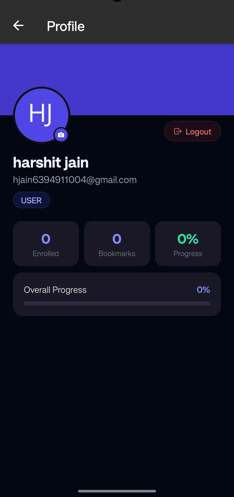
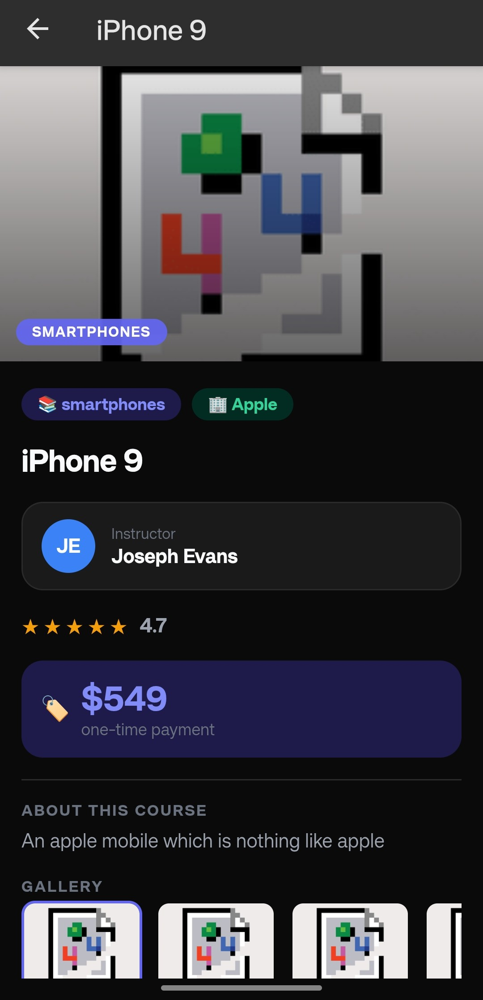

Nice, your README is already solid — just needs proper structure + screenshots section + missing docs parts.

Here’s a **clean, interview-ready README** you can directly paste 👇

---

# 📱 SkillBridge Mobile App

<p align="center">
  
</p>

<p align="center">
  Built using <b>Expo + React Native (Obytes Starter)</b>
</p>

---

## 🎥 Demo Video
https://drive.google.com/file/d/1YOhMwLb6jmsRUNH82FfoqOkD8kizatWv/view?usp=sharing

## 📦 APK Download

The development build APK is available in the Releases section.
https://github.com/harshitjain63/skillbridge-mobile/releases/tag/v1.0.0

## ⚙️ Native Setup Note

The `android` and `ios` directories are intentionally ignored as this project uses Expo's managed workflow.

To generate native projects locally, run:

pnpm prebuild
pnpm android
# or
pnpm ios

## 🚀 Features

### 🔐 Authentication

* Login & Register flow
* Secure token storage using **Expo SecureStore**
* Auto-login on app restart
* Logout functionality
* Basic token handling

---

### 📚 Course Feed

* API integration using **React Query**
* Search functionality
* Pull-to-refresh
* Optimized list using **FlashList**
* Loading, empty & error states
* Bookmark toggle

---

### 📄 Course Detail

* Course information (title, instructor, description)
* Image rendering with fallback handling
* Bookmark toggle
* Enroll button with feedback

---

### 🔖 Bookmark System

* State management using **Zustand**
* Persistent storage using **MMKV**
* Bookmark listing screen
* Auto hydration on app load

---

### 🌐 WebView Integration

* Route: `/feed/[id]/content`
* Injected data from native → WebView
* Interactive HTML UI
* Two-way communication using `postMessage`

---

### 🔔 Notifications

* Triggered after bookmarking 5 courses
* Permission handling
* Local notification scheduling

---

## 🧱 Tech Stack

* React Native (Expo SDK 54)
* TypeScript (strict mode)
* Expo Router
* NativeWind (Tailwind CSS)
* React Query
* Zustand
* MMKV (app data)
* Expo SecureStore (auth tokens)
* React Native WebView
* Expo Notifications

---

## ⚙️ Setup Instructions

```bash
git clone https://github.com/harshitjain63/skillbridge-mobile.git
cd skillbridge-app

pnpm install
```

Run app:

```bash
pnpm android
# or
pnpm ios
```

---

## 🔐 Environment Variables

Create a `.env` file in root:

```env
# Application Environment
EXPO_PUBLIC_APP_ENV=development

# API Configuration
EXPO_PUBLIC_API_URL=https://api.freeapi.app/api/v1

# Example Variables
EXPO_PUBLIC_VAR_NUMBER=10
EXPO_PUBLIC_VAR_BOOL=true

# Build-time only (NOT exposed to app)
SECRET_KEY=my-secret-key
APP_BUILD_ONLY_VAR=build-only-value
```

👉 Used in:

* API client configuration (src/api/client.ts)
* Environment-based builds

---

## 🧩 Optional / Supporting Technologies

* **Form Handling:** React Hook Form principles (implemented using TanStack Form)
* **Validation:** Zod (schema-based validation with TypeScript support)
* **Image Handling:** Expo Image (optimized loading with caching, placeholder, and error fallback handling)

---

---

## 🏗️ Key Architectural Decisions

* **Zustand** → lightweight global state (auth, bookmarks)
* **MMKV** → fast local storage for app data
* **SecureStore** → secure storage for auth tokens
* **React Query** → server state + caching
* **Expo Router** → file-based navigation
* **Modular folder structure** → feature-based separation

---

## 📱 Screenshots

### 🔐 Auth Screens

<p>
  
  
</p>

### 📚 Course Feed

<p>
  
</p>

### 📄 Course Detail

<p>
  
</p>

### 👤 Profile

<p>
  
</p>

### 🌐 WebView

<p>
  
</p>

---

## ⚠️ Known Issues / Limitations

* Some external API images fail to load in React Native due to **CORS / CDN restrictions**
* Placeholder handling added as fallback
* UI can be further improved
* No backend-controlled pagination

---

## 🔄 Orientation Support

* Supports both **Portrait & Landscape**
* Configured via Expo settings

---

## ✍️ Additional Notes

* Used `.env` for API base URL configuration
* Clean error handling using `react-native-flash-message`
* Optimized image loading using `expo-image`

---

## 📚 Documentation References

* Obytes Starter Docs
* Expo Documentation
* React Query Docs

---

## 👨‍💻 Author

**Harshit Jain**

---
